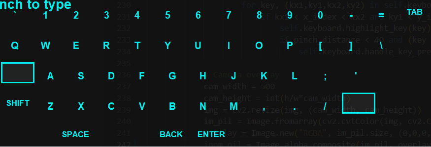

# AirKeyboard 🖐️⌨️

A **Python-based virtual keyboard** controlled using **hand gestures** captured via your webcam. Type in the air without touching a physical keyboard!



---

## **Features**
- Type in the air using your **index finger**.
- Uses **MediaPipe** for accurate hand tracking.
- Visual **keyboard with hover and click effects**.
- Real-time **text display** on the screen.
- Works on any text input field via **PyAutoGUI**.

---

## **Installation**

1. Clone the repository:

```bash
git clone https://github.com/rishi-bhatnagar/AirKeyboard.git
cd AirKeyboard

pip install -r requirements.txt

python main.py
